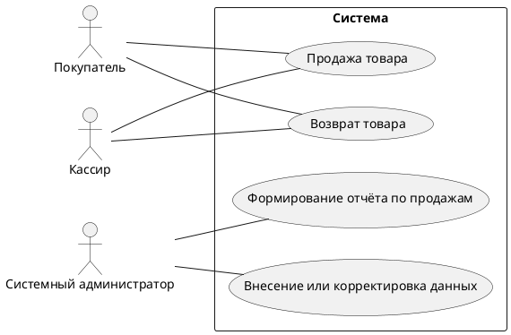

# Видение
## Даты внесения изменений
| Версия | Дата | Описание | Автор|
--- | --- | --- | --- |
| Черновой начальный вариант | 04 сентября, 2025 | Первый черновой вариант. Будет уточнен на стадии развития | Куликова Екатерина |

## Введение
Основным объектом моделирования и проектирования является информационная система, позволяющая автоматизировать процесс взаимодействия посетителей и организаторов матчей, а именно обспечивающая систему оборота (покупки и сдачи) билетов и абонементов на футбольные матчи.

## Позиционирование

### Место системы 

## Заинтересованные лица 
Система в исходном варианте предназначена для клиентов футбольных клубов, а именно для желающих посетить футбольный матч организации.

### Заинтересованные лица, не являющиеся пользователями системы
Лицом, не являющимся прямым пользователем системы, но заинтересованным в её работоспособности, является руководство организации. 
### Пользователи системы
Пользователями систем являются клиенты футбольных клубов, кассиры, а также администраторы.

| Цель высокого уровня | Приоритет | Проблемы и замечания | Текущие решения|
--- | --- | --- | --- |
| Введение информационной базы данных о продажах | Высокий | Сбои при большой нагрузке, связанные с одновременной работой нескольких лиц с базой. Неправильное заполнение значений полей в связи с человеческим фактором (оставление пустых значений, ошибки в заполнении) | Существующие решения в большинстве своём используют систему транзакций, позволяющих работать с базой одновременно. Также возможно наложить систему ограничений, позволяющих существенно уменьшить ошибки, связанные с заполнением БД
| Оперативное оказание услуг по покупке/сдаче билетов | Высокий | Возможные зависания при большой нагрузке на систему и как следствие ожидание клиента и кассира | Подобные проблемы решаются оптимизацией базы данных или физическим улучшением оборудования
|

### Задачи уровня пользователя 

Пользователи (и внешние системы) используют данную систему в таких целях.

 - Кассир. Оформляет покупку, возврат билета/абонемента.
 - Системный администратор. Управляет системой, при необходимости редактирует данные, следит за безопасностью.

### Перспективы продукта 

Система будет использоваться в кассах организации и в автоматах самообслуживания, опеспечивая базовый функционал покупки/продажи.

Система будет обслуживать пользователей и взаимодействовать с другими системами, как показано на рис. Видение 1. 

Рис. Видение 1. Контекстная диаграмма системы

### Преимущества системы 

| Свойство | Приемущества заинтересованных лиц|
 --- | --- |
| Обеспечение основного функционала по обороту товара: оформление продажи и возврата | Своевременная обработка операций и оперативное оказание услуги клиенту |
| Многопоточность и система транзакций, позволяющие работать с системой одновременно нескольким кассирам | Увеличение возможностей регистрации  и количества операций за единицу времени |
| Обеспечение логичной работы системы путём ручного и автоматического редактирования некорректных данных | Уменьшение ошибок, связанных с неправильных заполнением данных |

## Основные свойства системы 

- Оформление продаж.
- Системное администрирование и управление базой данных, безопасностью.
- Оформление процедур продажи и возврата билетов/абонементов.
- Обеспечение одновременной работы нескольких касс.

## Другие требования и ограничения 
Ограничения для процесса проектирования, удобства использования, надежности, производи­тельности, перечень документации и т.д. описаны в дополнительной спецификации и модели прецедентов. 
