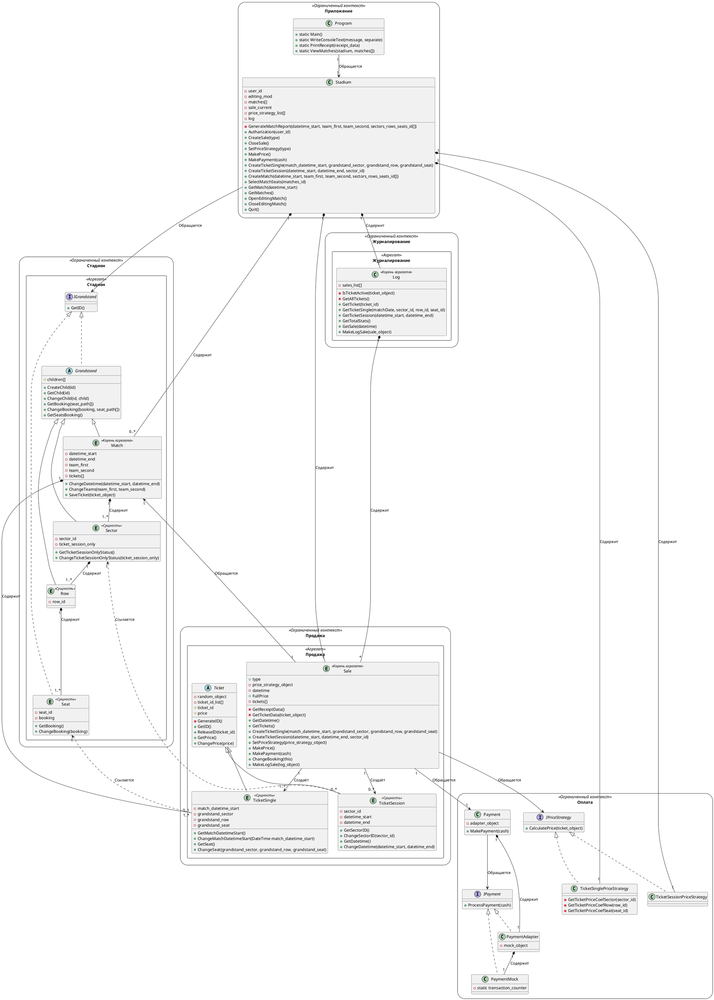

```plantuml
@startuml

!define BOUNDED_CONTEXT(name) rectangle name <<Ограниченный контекст>>
!define AGGREGATE(name) rectangle name <<Агрегат>>
!define AGGREGATE_ROOT(name) class name <<Корень агрегата>>


skinparam <<Ограниченный контекст>>{
    roundcorner 50
    PackageTitleAlignment 60
}


BOUNDED_CONTEXT("Приложение") as ApplicationContext{

    class Program
    {
        + static Main()
        + static WriteConsoleText(message, separate)
        + static PrintReceipt(receipt_data)
        + static ViewMatches(stadium, matches[])
    }
    class Stadium
    {
        - user_id
        - editing_mod
        - matches[]
        - sale_current
        - price_strategy_list[]
        - log
        - GenerateMatchReport(datetime_start, team_first, team_second, sectors_rows_seats_id[])
        + Autharization(user_id)
        + CreateSale(type)
        + CloseSale()
        + SetPriceStrategy(type)
        + MakePrice()
        + MakePayment(cash)
        + CreateTicketSingle(match_datetime_start, grandstand_sector, grandstand_row, grandstand_seat)
        + CreateTicketSession(datetime_start, datetime_end, sector_id)
        + CreateMatch(datetime_start, team_first, team_second, sectors_rows_seats_id[])
        + SelectMatchSeats(matches_id)
        + GetMatch(datetime_start)
        + GetMatches()
        + OpenEditingMatch()
        + CloseEditingMatch()
        + Quit()
    }
}

BOUNDED_CONTEXT("Стадион") as SeatingContext{

    AGGREGATE("Стадион") {

        interface IGrandstand
        {
            + GetID()
        }

        abstract class Grandstand implements IGrandstand
        {
            # children[]
            + CreateChild(id)
            + GetChild(id)
            + ChangeChild(id, child)
            + GetBooking(seat_path[])
            + ChangeBooking(booking, seat_path[])
            + GetSeatsBooking()
        }


        entity Match <<Корень агрегата>> extends Grandstand
        {
            - datetime_start
            - datetime_end
            - team_first
            - team_second
            - tickets[]
            + ChangeDatetime(datetime_start, datetime_end)
            + ChangeTeams(team_first, team_second)
            + SaveTicket(ticket_object)
        }

        entity Sector <<Сущность>> extends Grandstand
        {
            - sector_id
            - ticket_session_only
            + GetTicketSessionOnlyStatus()
            + ChangeTicketSessionOnlyStatus(ticket_session_only)
        }

        entity Row <<Сущность>> extends Grandstand
        {
            - row_id
        }

        entity Seat <<Сущность>> implements IGrandstand
        {
            - seat_id
            - booking
            + GetBooking()
            + ChangeBooking(booking)
        }
    }
}

BOUNDED_CONTEXT("Продажа") as SaleContext{

    AGGREGATE("Продажа") {

        abstract class Ticket
        {
            - random_object
            - ticket_id_list[]
            # ticket_id
            # price
            - GenerateID()
            + GetID()
            + ReleaseID(ticket_id)
            + GetPrice()
            + ChangePrice(price)
        }

        entity TicketSingle <<Сущность>> extends Ticket
        {
            - match_datetime_start
            - grandstand_sector
            - grandstand_row
            - grandstand_seat
            + GetMatchDatetimeStart()
            + ChangeMatchDatetimeStart(DateTime match_datetime_start)
            + GetSeat()
            + ChangeSeat(grandstand_sector, grandstand_row, grandstand_seat)
        }

        entity TicketSession <<Сущность>> extends Ticket
        {
            - sector_id
            - datetime_start
            - datetime_end
            + GetSectorID()
            + ChangeSectorID(sector_id)
            + GetDatetime()
            + ChangeDatetime(datetime_start, datetime_end)
        }


        entity Sale <<Корень агрегата>>
        {
            + type
            - price_strategy_object
            - datetime
            + FullPrice
            - tickets[]
            - GetReceiptData()
            - GetTicketData(ticket_object)
            + GetDatetime()
            + GetTickets()
            + CreateTicketSingle(match_datetime_start, grandstand_sector, grandstand_row, grandstand_seat)
            + CreateTicketSession(datetime_start, datetime_end, sector_id)
            + SetPriceStrategy(price_strategy_object)
            + MakePrice()
            + MakePayment(cash)
            + ChangeBooking(this)
            + MakeLogSale(log_object)
        }
    }
}

BOUNDED_CONTEXT("Оплата") as PayContext{

    interface IPriceStrategy
    {
        + CalculatePrice(ticket_object)
    }

    class TicketSinglePriceStrategy implements IPriceStrategy
    {
        - GetTicketPriceCoefSector(sector_id)
        - GetTicketPriceCoefRow(row_id)
        - GetTicketPriceCoefSeat(seat_id)
    }

    class TicketSessionPriceStrategy implements IPriceStrategy {}

    interface IPayment
    {
        + ProcessPayment(cash)
    }

    class PaymentMock implements IPayment
    {
        - static transaction_counter
    }

    class PaymentAdapter implements IPayment
    {
        - mock_object
    }

    class Payment
    {
        - adapter_object
        + MakePayment(cash)
    }
}

BOUNDED_CONTEXT("Журналирование") as LogContext{

    AGGREGATE("Журналирование") {

        class Log <<Корень агрегата>>
        {
            - sales_list[]
            - IsTicketActive(ticket_object)
            - GetAllTickets()
            + GetTicket(ticket_id)
            + GetTicketSingle(matchDate, sector_id, row_id, seat_id)
            + GetTicketSession(datetime_start, datetime_end)
            + GetTotalStats()
            + GetSale(datetime)
            + MakeLogSale(sale_object)
        }
    }
}

Program "1" --> "1" Stadium : Обращается
Stadium "1" *-- "0..*" Match : Содержит
Stadium "1" *-- "1" Sale : Содержит
Stadium "1" *-- "1" Log : Содержит
Stadium --> IGrandstand : Обращается

Match "1" *-- "1..*" Sector : Содержит
Sector "1" *-- "1..*" Row : Содержит
Row "1" *-- "1..*" Seat : Содержит

Match "1" *-- "1..*" TicketSingle : Содержит
Seat "1" <.. "0..1" TicketSingle : Ссылается
Sector "1" <.. "0..*" TicketSession : Ссылается

Stadium "1" *-- "1" TicketSinglePriceStrategy : Содержит
Stadium "1" *-- "1" TicketSessionPriceStrategy : Содержит
Sale --> IPriceStrategy : Обращается

Sale "1" --> "1" Payment : Обращается
Payment "1" *-- "1" PaymentAdapter : Содержит
Payment --> IPayment : Обращается
PaymentAdapter "1" *-- "1" PaymentMock : Содержит

Sale "1" --> "1..*" TicketSingle : Создаёт
Sale "1" --> "0..*" TicketSession : Создаёт
Match "1" <-- "1" Sale : Обращается
Log "1" *-- "*" Sale : Содержит

@enduml
```
