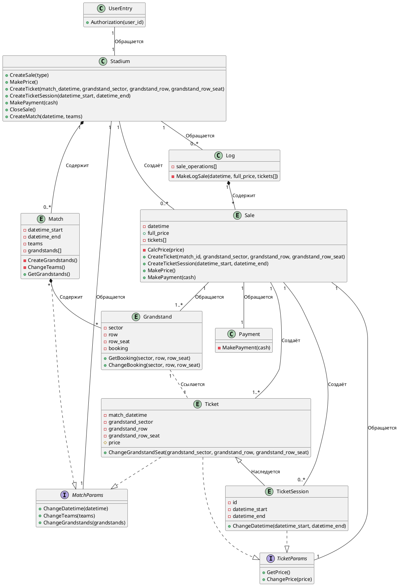

```plantuml
@startuml
class UserEntry
{
    + Authorization(user_id)
}
class Stadium
{
    + CreateSale(type)
    + MakePrice()
    + CreateTicket(match_datetime, grandstand_sector, grandstand_row, grandstand_row_seat)
    + CreateTicketSession(datetime_start, datetime_end)
    + MakePayment(cash)
    + CloseSale()
    + CreateMatch(datetime, teams)
}
entity Match
{
    - datetime_start
    - datetime_end
    - teams
    - grandstands[]
    - CreateGrandstands()
    - ChangeTeams()
    + GetGrandstands()
}
entity Grandstand
{
    - sector
    - row
    - row_seat
    - booking
    + GetBooking(sector, row, row_seat)
    + ChangeBooking(sector, row, row_seat)
}
entity Ticket
{
    - match_datetime
    - grandstand_sector
    - grandstand_row
    - grandstand_row_seat
    # price
    + ChangeGrandstandSeat(grandstand_sector, grandstand_row, grandstand_row_seat)
}
entity TicketSession
{
    - id
    - datetime_start
    - datetime_end
    + ChangeDatetime(datetime_start, datetime_end)
}
entity Sale
{
    - datetime
    + full_price
    - tickets[]
    - CalcPrice(price)
    + CreateTicket(match_id, grandstand_sector, grandstand_row, grandstand_row_seat)
    + CreateTicketSession(datetime_start, datetime_end)
    + MakePrice()
    + MakePayment(cash)
}
class Payment
{
    - MakePayment(cash)
}
class Log
{
    - sale_operations[]
    - MakeLogSale(datetime, full_price, tickets[])
}


interface MatchParams
{
    + ChangeDatetime(datetime)
    + ChangeTeams(teams)
    + ChangeGrandstands(grandstands)
}
interface TicketParams
{
    + GetPrice()
    + ChangePrice(price)
}

UserEntry "1" -- "1" Stadium : Обращается
Stadium "1" *-- "0..*" Match : Содержит
Stadium "1" -- "0..*" Sale : Создаёт
Stadium "1" -- "0..*" Log : Обращается
Stadium "1" -- "1" MatchParams: Обращается

Match "*" *-- "*" Grandstand : Содержит
Ticket <|-- TicketSession : Наследуется
Grandstand "1" .. "1" Ticket : Ссылается

Sale "1" -- "1" Payment : Обращается
Sale "1" -- "1..*" Ticket : Создаёт
Sale "1" -- "0..*" TicketSession : Создаёт
Sale "1" -- "1" TicketParams : Обращается
Sale "1" -- "1..*" Grandstand : Обращается

Log "1" *-- "*" Sale : Содержит

Match ..|> MatchParams
Ticket ..|> MatchParams

Ticket ..|> TicketParams
TicketSession ..|> TicketParams
@enduml
```
