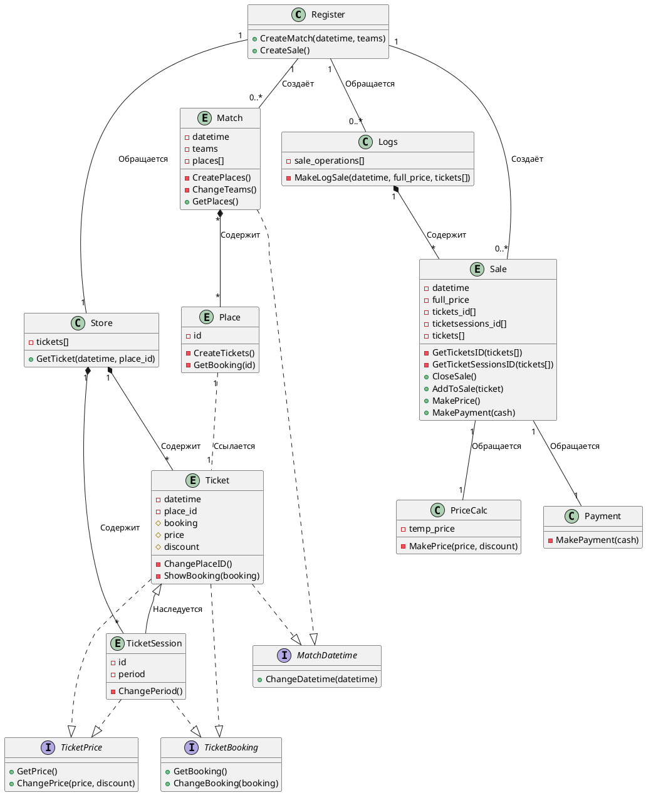

```plantuml
@startuml
class Register
{
    + CreateMatch(datetime, teams)
    + CreateSale()
}
entity Match
{
    - datetime
    - teams
    - places[]
    - CreatePlaces()
    - ChangeTeams()
    + GetPlaces()
}
entity Place
{
    - id
    - CreateTickets()
    - GetBooking(id)
}
entity Ticket
{
    - datetime
    - place_id
    # booking
    # price
    # discount
    - ChangePlaceID()
    - ShowBooking(booking)
}
entity TicketSession
{
    - id
    - period
    - ChangePeriod()
}
class Store
{
    - tickets[]
    + GetTicket(datetime, place_id)
}
entity Sale
{
    - datetime
    - full_price
    - tickets_id[]
    - ticketsessions_id[]
    - tickets[]
    - GetTicketsID(tickets[])
    - GetTicketSessionsID(tickets[])
    + CloseSale()
    + AddToSale(ticket)
    + MakePrice()
    + MakePayment(cash)
}
class PriceCalc
{
    - temp_price
    - MakePrice(price, discount)
}
class Payment
{
    - MakePayment(cash)
}
class Logs
{
    - sale_operations[]
    - MakeLogSale(datetime, full_price, tickets[])
}


interface MatchDatetime
{
    + ChangeDatetime(datetime)
}
interface TicketBooking
{
    + GetBooking()
    + ChangeBooking(booking)
}
interface TicketPrice
{
    + GetPrice()
    + ChangePrice(price, discount)
}


Register "1" -- "0..*" Match : Создаёт
Register "1" -- "1" Store : Обращается
Register "1" -- "0..*" Sale : Создаёт
Register "1" -- "0..*" Logs : Обращается

Match "*" *-- "*" Place : Содержит
Ticket <|-- TicketSession : Наследуется
Place "1" .. "1" Ticket : Ссылается

Store "1" *-- "*" Ticket : Содержит
Store "1" *-- "*" TicketSession : Содержит

Sale "1" -- "1" PriceCalc : Обращается
Sale "1" -- "1" Payment : Обращается
Logs "1" *-- "*" Sale : Содержит

Match ..|> MatchDatetime
Ticket ..|> MatchDatetime

Ticket ..|> TicketBooking
TicketSession ..|> TicketBooking
Ticket ..|> TicketPrice
TicketSession ..|> TicketPrice
@enduml
```
