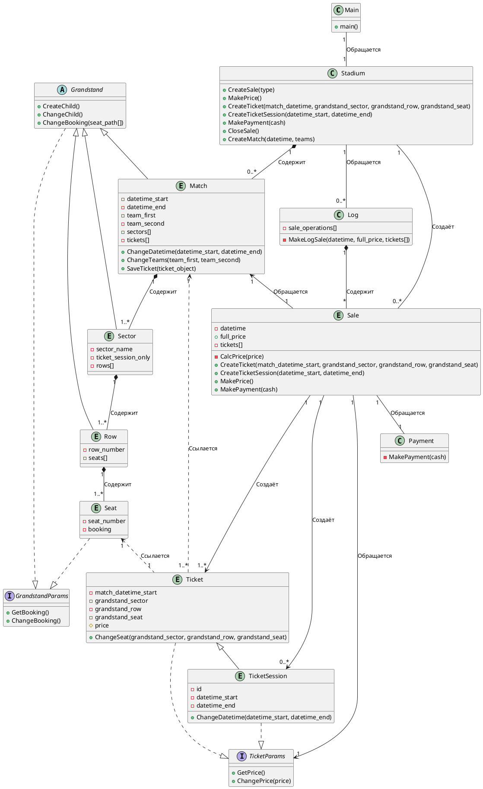

```plantuml
@startuml
class Main
{
    + main()
}
class Stadium
{
    + CreateSale(type)
    + MakePrice()
    + CreateTicket(match_datetime, grandstand_sector, grandstand_row, grandstand_seat)
    + CreateTicketSession(datetime_start, datetime_end)
    + MakePayment(cash)
    + CloseSale()
    + CreateMatch(datetime, teams)
}


abstract class Grandstand
{
    + CreateChild()
    + ChangeChild()
    + ChangeBooking(seat_path[])
}

entity Match extends Grandstand
{
    - datetime_start
    - datetime_end
    - team_first
    - team_second
    - sectors[]
    - tickets[]
    + ChangeDatetime(datetime_start, datetime_end)
    + ChangeTeams(team_first, team_second)
    + SaveTicket(ticket_object)
}

entity Sector extends Grandstand
{
    - sector_name
    - ticket_session_only
    - rows[]
}

entity Row extends Grandstand
{
    - row_number
    - seats[]
}

entity Seat
{
    - seat_number
    - booking
}

entity Ticket
{
    - match_datetime_start
    - grandstand_sector
    - grandstand_row
    - grandstand_seat
    # price
    + ChangeSeat(grandstand_sector, grandstand_row, grandstand_seat)
}

entity TicketSession extends Ticket
{
    - id
    - datetime_start
    - datetime_end
    + ChangeDatetime(datetime_start, datetime_end)
}

entity Sale
{
    - datetime
    + full_price
    - tickets[]
    - CalcPrice(price)
    + CreateTicket(match_datetime_start, grandstand_sector, grandstand_row, grandstand_seat)
    + CreateTicketSession(datetime_start, datetime_end)
    + MakePrice()
    + MakePayment(cash)
}

class Payment
{
    - MakePayment(cash)
}

class Log
{
    - sale_operations[]
    - MakeLogSale(datetime, full_price, tickets[])
}

interface GrandstandParams
{
    + GetBooking()
    + ChangeBooking()
}

interface TicketParams
{
    + GetPrice()
    + ChangePrice(price)
}

Main "1" -- "1" Stadium : Обращается
Stadium "1" *-- "0..*" Match : Содержит
Stadium "1" -- "0..*" Sale : Создаёт
Stadium "1" -- "0..*" Log : Обращается

Match "1" *-- "1..*" Sector : Содержит
Sector "1" *-- "1..*" Row : Содержит
Row "1" *-- "1..*" Seat : Содержит

Ticket "1..*" ..> "1" Match : Cсылается
Seat "1" <.. "1" Ticket : Ссылается

Sale "1" -- "1" Payment : Обращается
Sale "1" --> "1..*" Ticket : Создаёт
Sale "1" --> "0..*" TicketSession : Создаёт
Sale "1" --> "1" TicketParams : Обращается
Match "1" <-- "1" Sale : Обращается

Log "1" *-- "*" Sale : Содержит

Grandstand ..|> GrandstandParams
Seat ..|> GrandstandParams

Ticket ..|> TicketParams
TicketSession ..|> TicketParams
@enduml
```