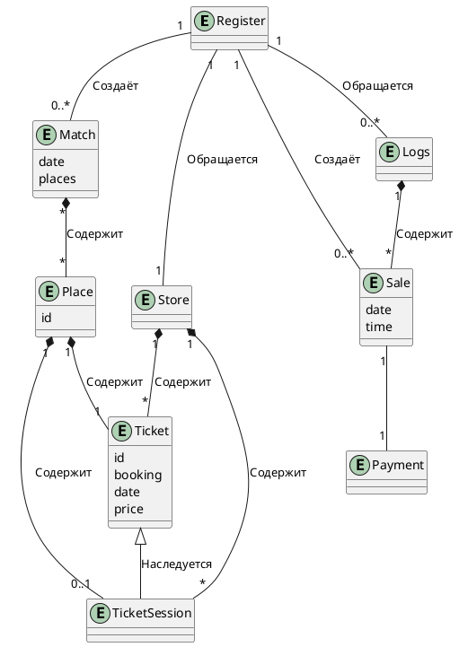

```plantuml
@startuml
entity Register
entity Match
{
    date
    places
}
entity Place
{
    id
}
entity Ticket
{
    id
    booking
    date
    price
}
entity TicketSession
entity Store
entity Sale
{
    date
    time
}
entity Payment
entity Logs

Register "1" -- "0..*" Match : Создаёт
Register "1" -- "1" Store : Обращается
Register "1" -- "0..*" Sale : Создаёт
Register "1" -- "0..*" Logs : Обращается

Match "*" *-- "*" Place : Содержит
Ticket <|-- TicketSession : Наследуется
Place "1" *-- "0..1" TicketSession : Содержит
Place "1" *-- "1" Ticket : Содержит

Store "1" *-- "*" Ticket : Содержит
Store "1" *-- "*" TicketSession : Содержит

Sale "1" -- "1" Payment
Logs "1" *-- "*" Sale : Содержит
@enduml
```
