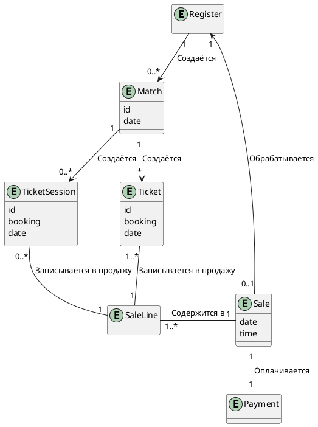

```plantuml
@startuml

entity Register
entity Match
{
    id
    date
}
entity Ticket
{
    id
    booking
    date
}
entity TicketSession
{
    id
    booking
    date
}
entity SaleLine
entity Sale
{
    date
    time
}
entity Payment

Register "1" <-down- "0..1" Sale : Обрабатывается
Register "1" -down-> "0..*" Match : Создаётся
Match "1" -down-> "*" Ticket : Создаётся
Match "1" -down-> "0..*" TicketSession : Создаётся
Ticket "1..*" -down- "1" SaleLine : Записывается в продажу
TicketSession "0..*" -down- "1" SaleLine : Записывается в продажу
SaleLine "1..*" -right- "1" Sale : Содержится в
Sale "1" -down- "1" Payment : Оплачивается

@enduml
```
