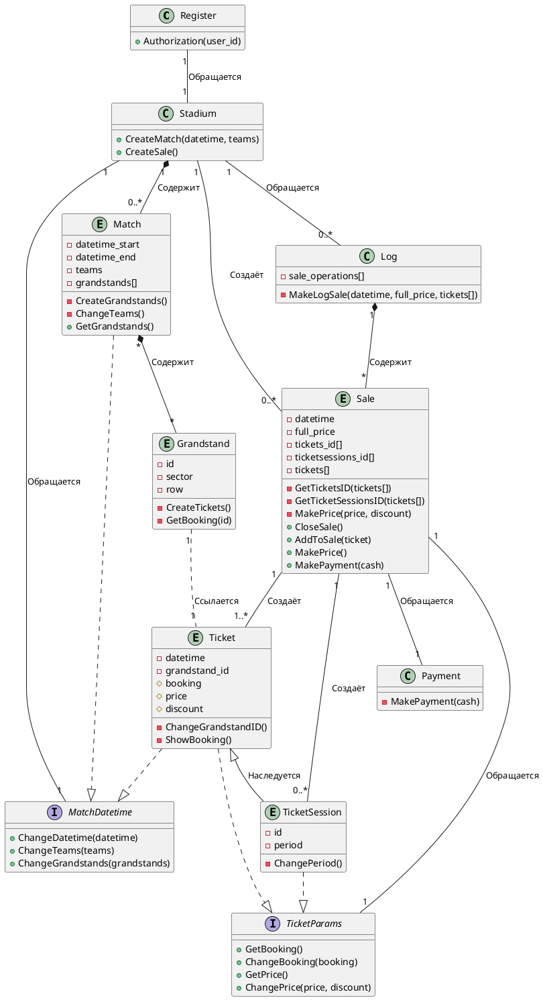

```plantuml
@startuml
class Register
{
    + Authorization(user_id)
}
class Stadium
{
    + CreateMatch(datetime, teams)
    + CreateSale()
}
entity Match
{
    - datetime_start
    - datetime_end
    - teams
    - grandstands[]
    - CreateGrandstands()
    - ChangeTeams()
    + GetGrandstands()
}
entity Grandstand
{
    - id
    - sector
    - row
    - CreateTickets()
    - GetBooking(id)
}
entity Ticket
{
    - datetime
    - grandstand_id
    # booking
    # price
    # discount
    - ChangeGrandstandID()
    - ShowBooking()
}
entity TicketSession
{
    - id
    - period
    - ChangePeriod()
}
entity Sale
{
    - datetime
    - full_price
    - tickets_id[]
    - ticketsessions_id[]
    - tickets[]
    - GetTicketsID(tickets[])
    - GetTicketSessionsID(tickets[])
    - MakePrice(price, discount)
    + CloseSale()
    + AddToSale(ticket)
    + MakePrice()
    + MakePayment(cash)
}
class Payment
{
    - MakePayment(cash)
}
class Log
{
    - sale_operations[]
    - MakeLogSale(datetime, full_price, tickets[])
}


interface MatchDatetime
{
    + ChangeDatetime(datetime)
    + ChangeTeams(teams)
    + ChangeGrandstands(grandstands)
}
interface TicketParams
{
    + GetBooking()
    + ChangeBooking(booking)
    + GetPrice()
    + ChangePrice(price, discount)
}

Register "1" -- "1" Stadium : Обращается
Stadium "1" *-- "0..*" Match : Содержит
Stadium "1" -- "0..*" Sale : Создаёт
Stadium "1" -- "0..*" Log : Обращается
Stadium "1" -- "1" MatchDatetime : Обращается

Match "*" *-- "*" Grandstand : Содержит
Ticket <|-- TicketSession : Наследуется
Grandstand "1" .. "1" Ticket : Ссылается

Sale "1" -- "1" Payment : Обращается
Sale "1" -- "1..*" Ticket : Создаёт
Sale "1" -- "0..*" TicketSession : Создаёт
Sale "1" -- "1" TicketParams : Обращается

Log "1" *-- "*" Sale : Содержит

Match ..|> MatchDatetime
Ticket ..|> MatchDatetime

Ticket ..|> TicketParams
TicketSession ..|> TicketParams
@enduml
```
