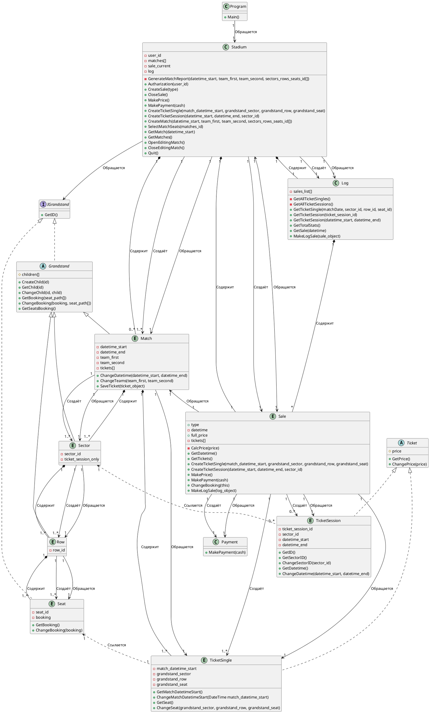

```plantuml
@startuml
class Program
{
    + Main()
}
class Stadium
{
    - user_id
    - matches[]
    - sale_current
    - log
    - GenerateMatchReport(datetime_start, team_first, team_second, sectors_rows_seats_id[])
    + Autharization(user_id)
    + CreateSale(type)
    + CloseSale()
    + MakePrice()
    + MakePayment(cash)
    + CreateTicketSingle(match_datetime_start, grandstand_sector, grandstand_row, grandstand_seat)
    + CreateTicketSession(datetime_start, datetime_end, sector_id)
    + CreateMatch(datetime_start, team_first, team_second, sectors_rows_seats_id[])
    + SelectMatchSeats(matches_id)
    + GetMatch(datetime_start)
    + GetMatches()
    + OpenEditingMatch()
    + CloseEditingMatch()
    + Quit()
}

interface IGrandstand
{
    + GetID()
}

abstract class Grandstand implements IGrandstand
{
    # children[]
    + CreateChild(id)
    + GetChild(id)
    + ChangeChild(id, child)
    + GetBooking(seat_path[])
    + ChangeBooking(booking, seat_path[])
    + GetSeatsBooking()
}

entity Match extends Grandstand
{
    - datetime_start
    - datetime_end
    - team_first
    - team_second
    - tickets[]
    + ChangeDatetime(datetime_start, datetime_end)
    + ChangeTeams(team_first, team_second)
    + SaveTicket(ticket_object)
}

entity Sector extends Grandstand
{
    - sector_id
    - ticket_session_only
}

entity Row extends Grandstand
{
    - row_id
}

entity Seat implements IGrandstand
{
    - seat_id
    - booking
    + GetBooking()
    + ChangeBooking(booking)
}

abstract class Ticket
{
    # price
    + GetPrice()
    + ChangePrice(price)
}

entity TicketSingle implements Ticket
{
    - match_datetime_start
    - grandstand_sector
    - grandstand_row
    - grandstand_seat
    + GetMatchDatetimeStart()
    + ChangeMatchDatetimeStart(DateTime match_datetime_start)
    + GetSeat()
    + ChangeSeat(grandstand_sector, grandstand_row, grandstand_seat)
}

entity TicketSession implements Ticket
{
    - ticket_session_id
    - sector_id
    - datetime_start
    - datetime_end
    + GetID()
    + GetSectorID()
    + ChangeSectorID(sector_id)
    + GetDatetime()
    + ChangeDatetime(datetime_start, datetime_end)
}

entity Sale
{
    + type
    - datetime
    + full_price
    - tickets[]
    - CalcPrice(price)
    + GetDatetime()
    + GetTickets()
    + CreateTicketSingle(match_datetime_start, grandstand_sector, grandstand_row, grandstand_seat)
    + CreateTicketSession(datetime_start, datetime_end, sector_id)
    + MakePrice()
    + MakePayment(cash)
    + ChangeBooking(this)
    + MakeLogSale(log_object)
}

class Payment
{
    + MakePayment(cash)
}

class Log
{
    - sales_list[]
    - GetAllTicketSingles()
    - GetAllTicketSessions()
    + GetTicketSingle(matchDate, sector_id, row_id, seat_id)
    + GetTicketSession(ticket_session_id)
    + GetTicketSession(datetime_start, datetime_end)
    + GetTotalStats()
    + GetSale(datetime)
    + MakeLogSale(sale_object)
}


Program "1" --> "1" Stadium : Обращается
Stadium "1" *-- "0..*" Match : Содержит
Stadium "1" --> "1..*" Match : Создаёт
Stadium "1" --> "1" Match : Обращается
Stadium "1" *-- "1" Sale : Содержит
Stadium "1" --> "1" Sale : Создаёт
Stadium "1" <--> "1" Sale : Обращается
Stadium "1" *-- "1" Log : Содержит
Stadium "1" --> "1" Log : Создаёт
Stadium "1" --> "1" Log : Обращается


Match "1" *-- "1..*" Sector : Содержит
Match "1" --> "1..*" Sector : Создаёт
Match "1" --> "1" Sector : Обращается
Sector "1" *-- "1..*" Row : Содержит
Sector "1" --> "1..*" Row : Создаёт
Sector "1" --> "1" Row : Обращается
Row "1" *-- "1..*" Seat : Содержит
Row "1" --> "1..*" Seat : Создаёт
Row "1" --> "1" Seat : Обращается

Match "1" *-- "1..*" TicketSingle : Содержит
Match "1" --> "1" TicketSingle : Обращается
Seat "1" <.. "1" TicketSingle : Ссылается
Sector "1" <.. "0..*" TicketSession : Ссылается

Sale "1" --> "1" Payment : Создаёт
Sale "1" --> "1" Payment : Обращается
Sale "1" --> "1..*" TicketSingle : Создаёт
Sale "1" --> "1" TicketSingle : Обращается
Sale "1" --> "0..*" TicketSession : Создаёт
Sale "1" --> "1" TicketSession : Обращается
Match "1" <-- "1" Sale : Обращается
Log "1" *-- "*" Sale : Содержит

Stadium --> IGrandstand : Обращается
@enduml
```