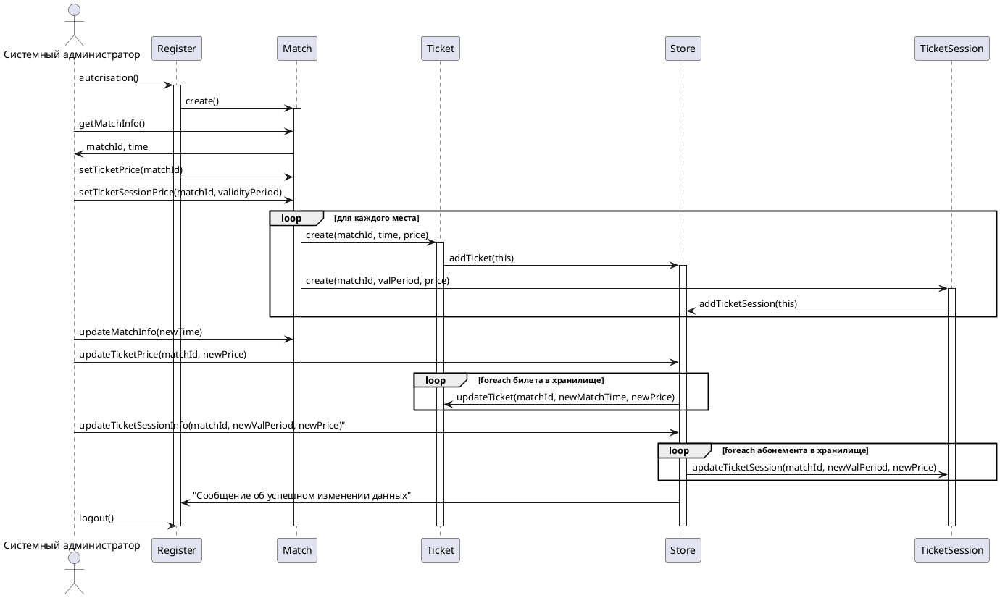

```plantuml
@startuml

actor "Системный администратор"

"Системный администратор" -> Register : autorisation()
activate Register
Register -> Match : create()
activate Match
"Системный администратор" -> Match : getMatchInfo()
"Системный администратор" <- Match : matchId, time
"Системный администратор" -> Match : setTicketPrice(matchId)
"Системный администратор" -> Match : setTicketSessionPrice(matchId, validityPeriod)

loop для каждого места
Match -> Ticket : create(matchId, time, price)
activate Ticket
Ticket -> Store : addTicket(this)
activate Store

Match -> TicketSession : create(matchId, valPeriod, price)
activate TicketSession
TicketSession -> Store : addTicketSession(this)

end

"Системный администратор" -> Match : updateMatchInfo(newTime)
"Системный администратор" -> Store: updateTicketPrice(matchId, newPrice)

loop foreach билета в хранилище
Store -> Ticket : updateTicket(matchId, newMatchTime, newPrice)
end

"Системный администратор" -> Store: updateTicketSessionInfo(matchId, newValPeriod, newPrice)"

loop foreach абонемента в хранилище
Store -> TicketSession : updateTicketSession(matchId, newValPeriod, newPrice)
end

Register <- Store : "Сообщение об успешном изменении данных"
"Системный администратор" -> Register : logout()

deactivate Register
deactivate Match
deactivate Store
deactivate Ticket
deactivate TicketSession

@enduml
```
