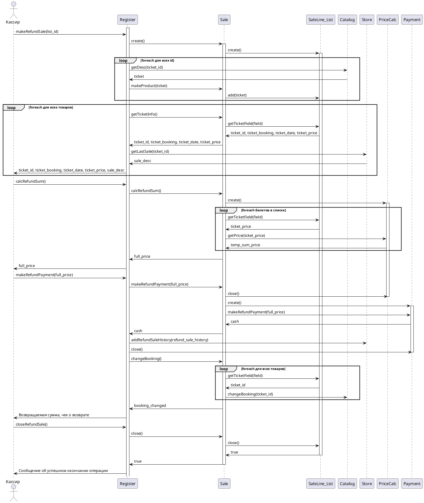

```plantuml
@startuml
actor Кассир

activate Register

Кассир -> Register : makeRefundSale(list_id)

Register -> Sale : create()

activate Sale
Sale -> SaleLine_List : create()

activate SaleLine_List

loop foreach для всех id
Register -> Catalog : getDesc(ticket_id)
Register <- Catalog : ticket
Register -> Sale : makeProduct(ticket)
Sale -> SaleLine_List : add(ticket)
end

loop foreach для всех товаров
Register -> Sale : getTicketInfo()
Sale -> SaleLine_List : getTicketField(field)
Sale <- SaleLine_List : ticket_id, ticket_booking, ticket_date, ticket_price
Register <- Sale : ticket_id, ticket_booking, ticket_date, ticket_price
Register -> Store : getLastSale(ticket_id)
Register <- Store : sale_desc
Кассир <- Register : ticket_id, ticket_booking, ticket_date, ticket_price, sale_desc
end

Кассир -> Register : calcRefundSum()
Register -> Sale : calcRefundSum()

Sale -> PriceCalc : create()
activate PriceCalc

loop foreach билетов в списке
Sale -> SaleLine_List : getTicketField(field)
Sale <- SaleLine_List : ticket_price
Sale -> PriceCalc : getPrice(ticket_price)
Sale <- PriceCalc : temp_sum_price
end

Register <- Sale : full_price
Кассир <- Register : full_price
Кассир -> Register : makeRefundPayment(full_price)
Register -> Sale : makeRefundPayment(full_price)

Sale -> PriceCalc : close()
deactivate PriceCalc

Sale -> Payment : create()
activate Payment

Sale -> Payment : makeRefundPayment(full_price)
Sale <- Payment : cash


Register <- Sale : cash
Register -> Store : addRefundSaleHistory(refund_sale_history)
Register -> Payment : close()
deactivate Payment

Register -> Sale: changeBooking()

loop foreach для всех товаров
Sale -> SaleLine_List : getTicketField(field)
Sale <- SaleLine_List : ticket_id
Sale -> Catalog : changeBooking(ticket_id)
end

Register <- Sale : booking_changed
Кассир <- Register : Возвращаемая сумма, чек о возврате

Кассир -> Register : closeRefundSale()
Register -> Sale : close()
Sale -> SaleLine_List : close()

Sale <- SaleLine_List : true
deactivate SaleLine_List
Register <- Sale : true
deactivate Sale
Кассир <- Register : Сообщение об успешном окончании операции
@enduml
```