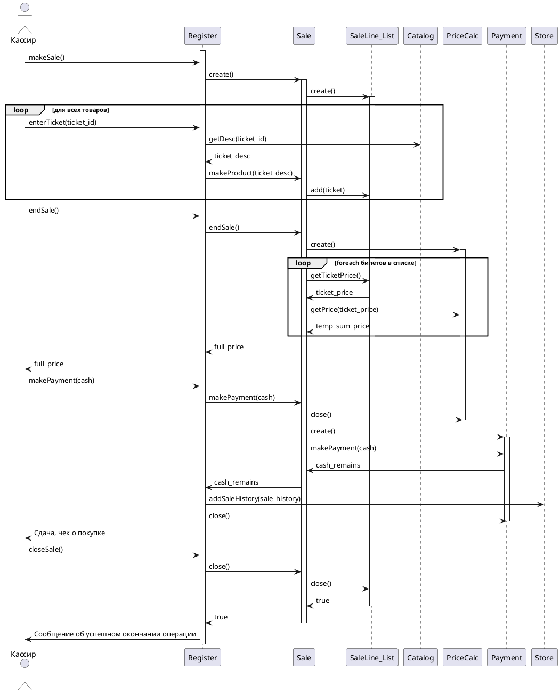

```plantuml
@startuml

actor Кассир

activate Register

Кассир -> Register : makeSale()

Register -> Sale : create()

activate Sale
Sale -> SaleLine_List : create()

activate SaleLine_List

loop для всех товаров
Кассир -> Register : enterTicket(ticket_id)
Register -> Catalog : getDesc(ticket_id)
Register <- Catalog : ticket_desc
Register -> Sale : makeProduct(ticket_desc)
Sale -> SaleLine_List : add(ticket)
end

Кассир -> Register : endSale()
Register -> Sale : endSale()

Sale -> PriceCalc : create()
activate PriceCalc

loop foreach билетов в списке
Sale -> SaleLine_List : getTicketPrice()
Sale <- SaleLine_List : ticket_price
Sale -> PriceCalc : getPrice(ticket_price)
Sale <- PriceCalc : temp_sum_price
end

Register <- Sale : full_price
Кассир <- Register : full_price
Кассир -> Register : makePayment(cash)
Register -> Sale : makePayment(cash)

Sale -> PriceCalc : close()
deactivate PriceCalc

Sale -> Payment : create()
activate Payment

Sale -> Payment : makePayment(cash)
Sale <- Payment : cash_remains


Register <- Sale : cash_remains
Register -> Store : addSaleHistory(sale_history)
Register -> Payment : close()
deactivate Payment

Кассир <- Register : Сдача, чек о покупке

Кассир -> Register : closeSale()
Register -> Sale : close()
Sale -> SaleLine_List : close()

Sale <- SaleLine_List : true
deactivate SaleLine_List
Register <- Sale : true
deactivate Sale
Кассир <- Register : Сообщение об успешном окончании операции

@enduml
```
