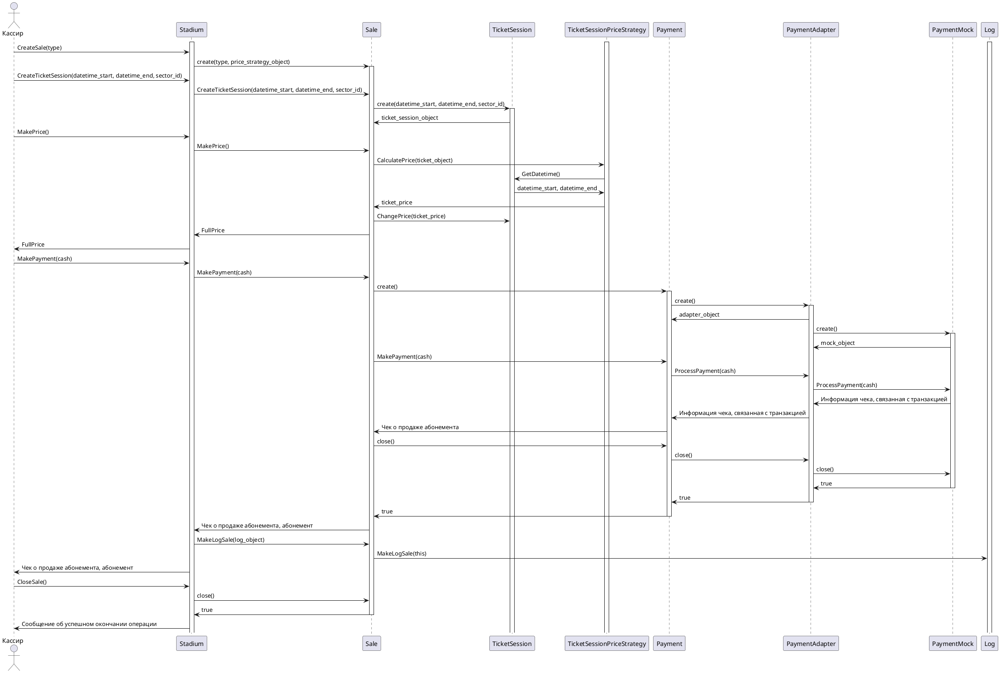

```plantuml
@startuml

actor Кассир
participant Stadium
participant Sale
participant TicketSession
participant TicketSessionPriceStrategy
participant Payment
participant PaymentAdapter
participant PaymentMock
participant Log

activate Stadium
activate TicketSessionPriceStrategy
activate Log

Кассир -> Stadium : CreateSale(type)
Stadium -> Sale : create(type, price_strategy_object)
activate Sale

Кассир -> Stadium : CreateTicketSession(datetime_start, datetime_end, sector_id)
Stadium -> Sale : CreateTicketSession(datetime_start, datetime_end, sector_id)
Sale -> TicketSession : create(datetime_start, datetime_end, sector_id)
activate TicketSession
Sale <- TicketSession : ticket_session_object

Кассир -> Stadium : MakePrice()
Stadium -> Sale : MakePrice()

Sale -> TicketSessionPriceStrategy : CalculatePrice(ticket_object)
TicketSessionPriceStrategy -> TicketSession : GetDatetime()
TicketSessionPriceStrategy <- TicketSession : datetime_start, datetime_end
Sale <- TicketSessionPriceStrategy : ticket_price
Sale -> TicketSession : ChangePrice(ticket_price)

Stadium <- Sale : FullPrice
Кассир <- Stadium : FullPrice

Кассир -> Stadium : MakePayment(cash)
Stadium -> Sale : MakePayment(cash)

Sale -> Payment : create()
activate Payment
Payment -> PaymentAdapter : create()
activate PaymentAdapter

Payment <- PaymentAdapter : adapter_object
PaymentAdapter -> PaymentMock: create()
activate PaymentMock
PaymentAdapter <- PaymentMock : mock_object

Sale -> Payment : MakePayment(cash)
Payment -> PaymentAdapter : ProcessPayment(cash)
PaymentAdapter -> PaymentMock : ProcessPayment(cash)
PaymentAdapter <- PaymentMock : Информация чека, связанная с транзакцией
Payment <- PaymentAdapter : Информация чека, связанная с транзакцией

Sale <- Payment : Чек о продаже абонемента
Sale -> Payment : close()
Payment -> PaymentAdapter : close()
PaymentAdapter -> PaymentMock : close()
PaymentAdapter <- PaymentMock : true
deactivate PaymentMock
Payment <- PaymentAdapter : true
deactivate PaymentAdapter
Sale <- Payment : true
deactivate Payment

Stadium <- Sale : Чек о продаже абонемента, абонемент

Stadium -> Sale : MakeLogSale(log_object)
Sale -> Log : MakeLogSale(this)

Кассир <- Stadium : Чек о продаже абонемента, абонемент

Кассир -> Stadium : CloseSale()
Stadium -> Sale : close()
Stadium <- Sale : true
deactivate Sale
Кассир <- Stadium : Сообщение об успешном окончании операции

@enduml
```