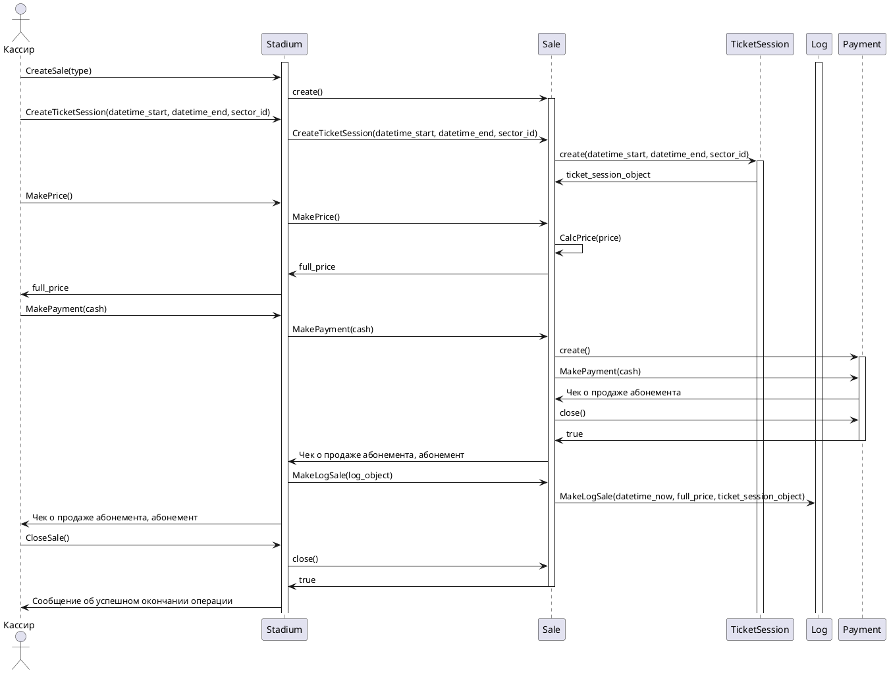

```plantuml
@startuml
actor Кассир

activate Stadium
participant Sale
participant TicketSession
activate Log

Кассир -> Stadium : CreateSale(type)
Stadium -> Sale : create()
activate Sale

Кассир -> Stadium : CreateTicketSession(datetime_start, datetime_end, sector_id)
Stadium -> Sale : CreateTicketSession(datetime_start, datetime_end, sector_id)
Sale -> TicketSession : create(datetime_start, datetime_end, sector_id)
activate TicketSession
Sale <- TicketSession : ticket_session_object


Кассир -> Stadium : MakePrice()
Stadium -> Sale : MakePrice()

Sale -> Sale : CalcPrice(price)


Stadium <- Sale : full_price
Кассир <- Stadium : full_price

Кассир -> Stadium : MakePayment(cash)
Stadium -> Sale : MakePayment(cash)
Sale -> Payment : create()

activate Payment
Sale -> Payment : MakePayment(cash)
Sale <- Payment : Чек о продаже абонемента
Sale -> Payment : close()
Sale <- Payment : true
deactivate Payment

Stadium <- Sale : Чек о продаже абонемента, абонемент

Stadium -> Sale : MakeLogSale(log_object)
Sale -> Log : MakeLogSale(datetime_now, full_price, ticket_session_object)

Кассир <- Stadium : Чек о продаже абонемента, абонемент

Кассир -> Stadium : CloseSale()
Stadium -> Sale : close()
Stadium <- Sale : true
deactivate Sale
Кассир <- Stadium : Сообщение об успешном окончании операции
@enduml
```