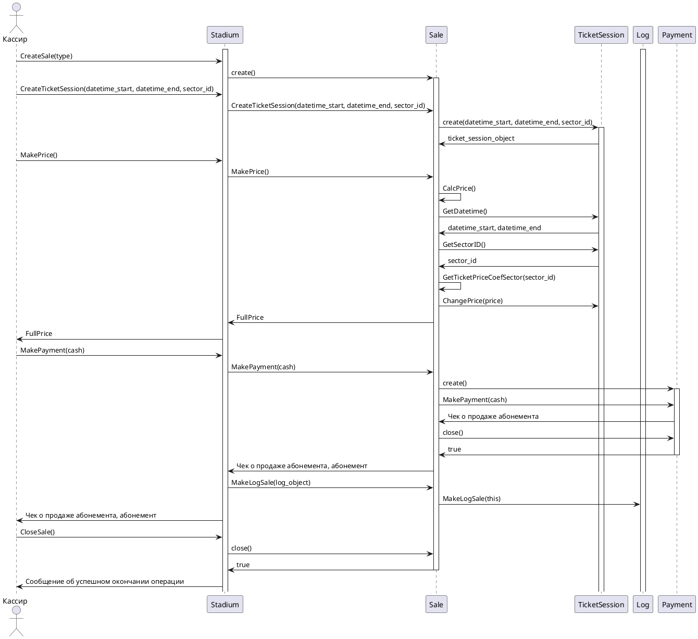

```plantuml
@startuml

actor Кассир
participant Stadium
participant Sale
participant TicketSession
participant Log
participant Payment

activate Stadium
activate Log

Кассир -> Stadium : CreateSale(type)
Stadium -> Sale : create()
activate Sale

Кассир -> Stadium : CreateTicketSession(datetime_start, datetime_end, sector_id)
Stadium -> Sale : CreateTicketSession(datetime_start, datetime_end, sector_id)
Sale -> TicketSession : create(datetime_start, datetime_end, sector_id)
activate TicketSession
Sale <- TicketSession : ticket_session_object

Кассир -> Stadium : MakePrice()
Stadium -> Sale : MakePrice()

Sale -> Sale : CalcPrice()
Sale -> TicketSession : GetDatetime()
Sale <- TicketSession : datetime_start, datetime_end
Sale -> TicketSession : GetSectorID()
Sale <- TicketSession : sector_id
Sale -> Sale : GetTicketPriceCoefSector(sector_id)
Sale -> TicketSession : ChangePrice(price)

Stadium <- Sale : FullPrice
Кассир <- Stadium : FullPrice

Кассир -> Stadium : MakePayment(cash)
Stadium -> Sale : MakePayment(cash)
Sale -> Payment : create()

activate Payment
Sale -> Payment : MakePayment(cash)
Sale <- Payment : Чек о продаже абонемента
Sale -> Payment : close()
Sale <- Payment : true
deactivate Payment

Stadium <- Sale : Чек о продаже абонемента, абонемент

Stadium -> Sale : MakeLogSale(log_object)
Sale -> Log : MakeLogSale(this)

Кассир <- Stadium : Чек о продаже абонемента, абонемент

Кассир -> Stadium : CloseSale()
Stadium -> Sale : close()
Stadium <- Sale : true
deactivate Sale
Кассир <- Stadium : Сообщение об успешном окончании операции

@enduml
```