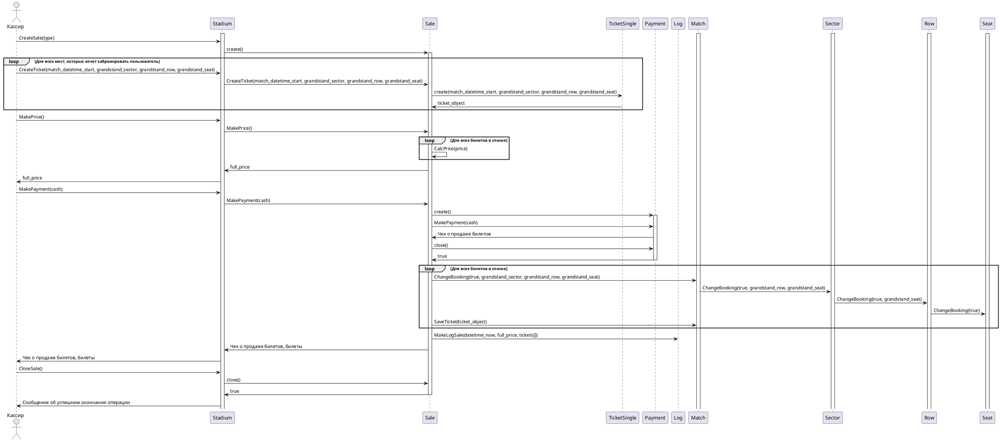

```plantuml
@startuml
actor Кассир

activate Stadium
participant Sale
participant TicketSingle
participant Payment
participant Log
activate Match
activate Sector
activate Row
activate Seat

Кассир -> Stadium : CreateSale(type)
Stadium -> Sale : create()
activate Sale


loop Для всех мест, которых хочет заброинровать пользователь

Кассир -> Stadium : CreateTicket(match_datetime_start, grandstand_sector, grandstand_row, grandstand_seat)
Stadium -> Sale : CreateTicket(match_datetime_start, grandstand_sector, grandstand_row, grandstand_seat)
Sale -> TicketSingle : create(match_datetime_start, grandstand_sector, grandstand_row, grandstand_seat)
Sale <- TicketSingle : ticket_object

end


Кассир -> Stadium : MakePrice()
Stadium -> Sale : MakePrice()


loop Для всех билетов в списке

Sale -> Sale : CalcPrice(price)

end


Stadium <- Sale : full_price
Кассир <- Stadium : full_price

Кассир -> Stadium : MakePayment(cash)
Stadium -> Sale : MakePayment(cash)
Sale -> Payment : create()

activate Payment
Sale -> Payment : MakePayment(cash)
Sale <- Payment : Чек о продаже билетов
Sale -> Payment : close()
Sale <- Payment : true
deactivate Payment


loop Для всех билетов в списке

Sale -> Match : ChangeBooking(true, grandstand_sector, grandstand_row, grandstand_seat)
Match -> Sector : ChangeBooking(true, grandstand_row, grandstand_seat)
Sector -> Row : ChangeBooking(true, grandstand_seat)
Row -> Seat : ChangeBooking(true)
Sale -> Match : SaveTicket(ticket_object)

end


Sale -> Log : MakeLogSale(datetime_now, full_price, tickets[])

Stadium <- Sale : Чек о продаже билетов, билеты
Кассир <- Stadium : Чек о продаже билетов, билеты


Кассир -> Stadium : CloseSale()
Stadium -> Sale : close()
Stadium <- Sale : true
deactivate Sale
Кассир <- Stadium : Сообщение об успешном окончании операции
@enduml
```