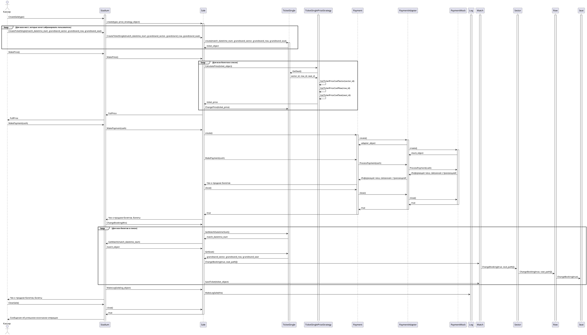

```plantuml
@startuml

actor Кассир
participant Stadium
participant Sale
participant TicketSingle
participant TicketSinglePriceStrategy
participant Payment
participant PaymentAdapter
participant PaymentMock
participant Log
participant Match
participant Sector
participant Row
participant Seat

activate Stadium
activate TicketSinglePriceStrategy
activate Log
activate Match
activate Sector
activate Row
activate Seat

Кассир -> Stadium : CreateSale(type)
Stadium -> Sale : create(type, price_strategy_object)
activate Sale


loop Для всех мест, которых хочет заброинровать пользователь

Кассир -> Stadium : CreateTicketSingle(match_datetime_start, grandstand_sector, grandstand_row, grandstand_seat)
Stadium -> Sale : CreateTicketSingle(match_datetime_start, grandstand_sector, grandstand_row, grandstand_seat)
Sale -> TicketSingle : create(match_datetime_start, grandstand_sector, grandstand_row, grandstand_seat)
activate TicketSingle
Sale <- TicketSingle : ticket_object

end


Кассир -> Stadium : MakePrice()
Stadium -> Sale : MakePrice()


loop Для всех билетов в списке

Sale -> TicketSinglePriceStrategy : CalculatePrice(ticket_object)

TicketSinglePriceStrategy -> TicketSingle : GetSeat()
TicketSinglePriceStrategy <- TicketSingle : sector_id, row_id, seat_id
TicketSinglePriceStrategy -> TicketSinglePriceStrategy : GetTicketPriceCoefSector(sector_id)
TicketSinglePriceStrategy -> TicketSinglePriceStrategy : GetTicketPriceCoefRow(row_id)
TicketSinglePriceStrategy -> TicketSinglePriceStrategy : GetTicketPriceCoefSeat(seat_id)

Sale <- TicketSinglePriceStrategy : ticket_price
Sale -> TicketSingle : ChangePrice(ticket_price)

end


Stadium <- Sale : FullPrice
Кассир <- Stadium : FullPrice

Кассир -> Stadium : MakePayment(cash)
Stadium -> Sale : MakePayment(cash)

Sale -> Payment : create()
activate Payment
Payment -> PaymentAdapter : create()
activate PaymentAdapter
Payment <- PaymentAdapter : adapter_object
PaymentAdapter -> PaymentMock: create()
activate PaymentMock
PaymentAdapter <- PaymentMock : mock_object

Sale -> Payment : MakePayment(cash)
Payment -> PaymentAdapter : ProcessPayment(cash)
PaymentAdapter -> PaymentMock : ProcessPayment(cash)
PaymentAdapter <- PaymentMock : Информация чека, связанная с транзакцией
Payment <- PaymentAdapter : Информация чека, связанная с транзакцией

Sale <- Payment : Чек о продаже билетов
Sale -> Payment : close()
Payment -> PaymentAdapter : close()
PaymentAdapter -> PaymentMock : close()
PaymentAdapter <- PaymentMock : true
deactivate PaymentMock
Payment <- PaymentAdapter : true
deactivate PaymentAdapter
Sale <- Payment : true
deactivate Payment

Stadium <- Sale : Чек о продаже билетов, билеты
Stadium -> Sale : ChangeBooking(this)


loop Для всех билетов в списке

Sale -> TicketSingle : GetMatchDatetimeStart()
Sale <- TicketSingle : match_datetime_start
Stadium <- Sale : GetMatch(match_datetime_start)
Stadium -> Sale : match_object
Sale -> TicketSingle : GetSeat()
Sale <- TicketSingle : grandstand_sector, grandstand_row, grandstand_seat
Sale -> Match : ChangeBooking(true, seat_path[])
Match -> Sector : ChangeBooking(true, seat_path[])
Sector -> Row : ChangeBooking(true, seat_path[])
Row -> Seat : ChangeBooking(true)
Sale -> Match : SaveTicket(ticket_object)

end


Stadium -> Sale : MakeLogSale(log_object)
Sale -> Log : MakeLogSale(this)

Кассир <- Stadium : Чек о продаже билетов, билеты

Кассир -> Stadium : CloseSale()
Stadium -> Sale : close()
Stadium <- Sale : true
deactivate Sale
Кассир <- Stadium : Сообщение об успешном окончании операции

@enduml
```