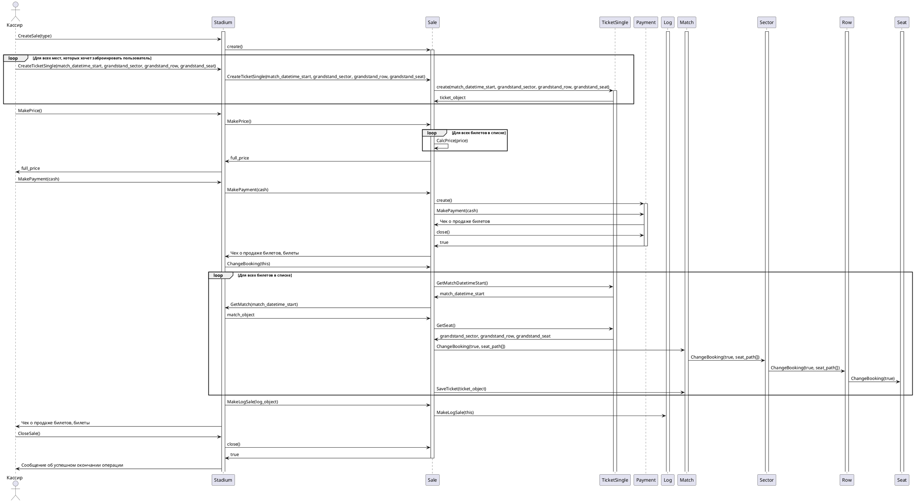

```plantuml
@startuml

actor Кассир
participant Stadium
participant Sale
participant TicketSingle
participant Payment
participant Log
participant Match
participant Sector
participant Row
participant Seat

activate Stadium
activate Match
activate Sector
activate Row
activate Seat
activate Log

Кассир -> Stadium : CreateSale(type)
Stadium -> Sale : create()
activate Sale


loop Для всех мест, которых хочет заброинровать пользователь

Кассир -> Stadium : CreateTicketSingle(match_datetime_start, grandstand_sector, grandstand_row, grandstand_seat)
Stadium -> Sale : CreateTicketSingle(match_datetime_start, grandstand_sector, grandstand_row, grandstand_seat)
Sale -> TicketSingle : create(match_datetime_start, grandstand_sector, grandstand_row, grandstand_seat)
activate TicketSingle
Sale <- TicketSingle : ticket_object

end


Кассир -> Stadium : MakePrice()
Stadium -> Sale : MakePrice()


loop Для всех билетов в списке

Sale -> Sale : CalcPrice(price)

end


Stadium <- Sale : full_price
Кассир <- Stadium : full_price

Кассир -> Stadium : MakePayment(cash)
Stadium -> Sale : MakePayment(cash)
Sale -> Payment : create()

activate Payment
Sale -> Payment : MakePayment(cash)
Sale <- Payment : Чек о продаже билетов
Sale -> Payment : close()
Sale <- Payment : true
deactivate Payment

Stadium <- Sale : Чек о продаже билетов, билеты
Stadium -> Sale : ChangeBooking(this)


loop Для всех билетов в списке

Sale -> TicketSingle : GetMatchDatetimeStart()
Sale <- TicketSingle : match_datetime_start
Stadium <- Sale : GetMatch(match_datetime_start)
Stadium -> Sale : match_object
Sale -> TicketSingle : GetSeat()
Sale <- TicketSingle : grandstand_sector, grandstand_row, grandstand_seat
Sale -> Match : ChangeBooking(true, seat_path[])
Match -> Sector : ChangeBooking(true, seat_path[])
Sector -> Row : ChangeBooking(true, seat_path[])
Row -> Seat : ChangeBooking(true)
Sale -> Match : SaveTicket(ticket_object)

end


Stadium -> Sale : MakeLogSale(log_object)
Sale -> Log : MakeLogSale(this)

Кассир <- Stadium : Чек о продаже билетов, билеты

Кассир -> Stadium : CloseSale()
Stadium -> Sale : close()
Stadium <- Sale : true
deactivate Sale
Кассир <- Stadium : Сообщение об успешном окончании операции

@enduml
```