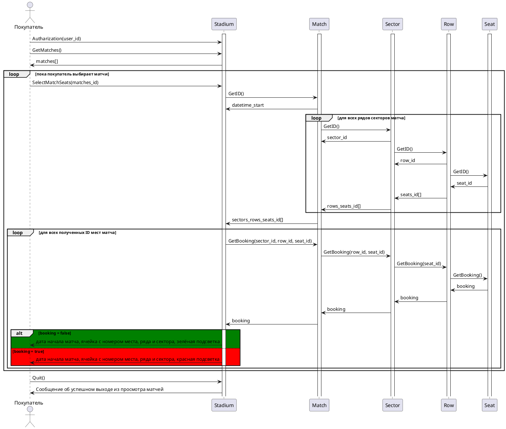

```plantuml
@startuml
actor Покупатель

activate Stadium
activate Match
activate Sector
activate Row
activate Seat

Покупатель -> Stadium : Autharization(user_id)

Покупатель -> Stadium : GetMatches()
Покупатель <- Stadium : matches[]


loop пока покупатель выбирает матчи

Покупатель -> Stadium : SelectMatchSeats(matches_id)
Stadium -> Match : GetID()
Stadium <- Match : datetime_start


loop для всех рядов секторов матча

Match -> Sector : GetID()
Match <- Sector : sector_id
Sector -> Row : GetID()
Sector <- Row : row_id
Row -> Seat : GetID()
Row <- Seat : seat_id
Sector <- Row : seats_id[]
Match <- Sector : rows_seats_id[]

end


Stadium <- Match : sectors_rows_seats_id[]


loop для всех полученных ID мест матча

Stadium -> Match : GetBooking(sector_id, row_id, seat_id)
Match -> Sector : GetBooking(row_id, seat_id)
Sector -> Row : GetBooking(seat_id)
Row -> Seat : GetBooking()
Row <- Seat : booking
Sector <- Row : booking
Match <- Sector : booking
Stadium <- Match : booking

alt #green booking = false
  Покупатель <- Stadium : дата начала матча, ячейка с номером места, ряда и сектора, зелёная подсветка
else #red booking = true
  Покупатель <- Stadium : дата начала матча, ячейка с номером места, ряда и сектора, красная подсветка
end

end


end


Покупатель -> Stadium : Quit()
Покупатель <- Stadium : Сообщение об успешном выходе из просмотра матчей

@enduml
```
