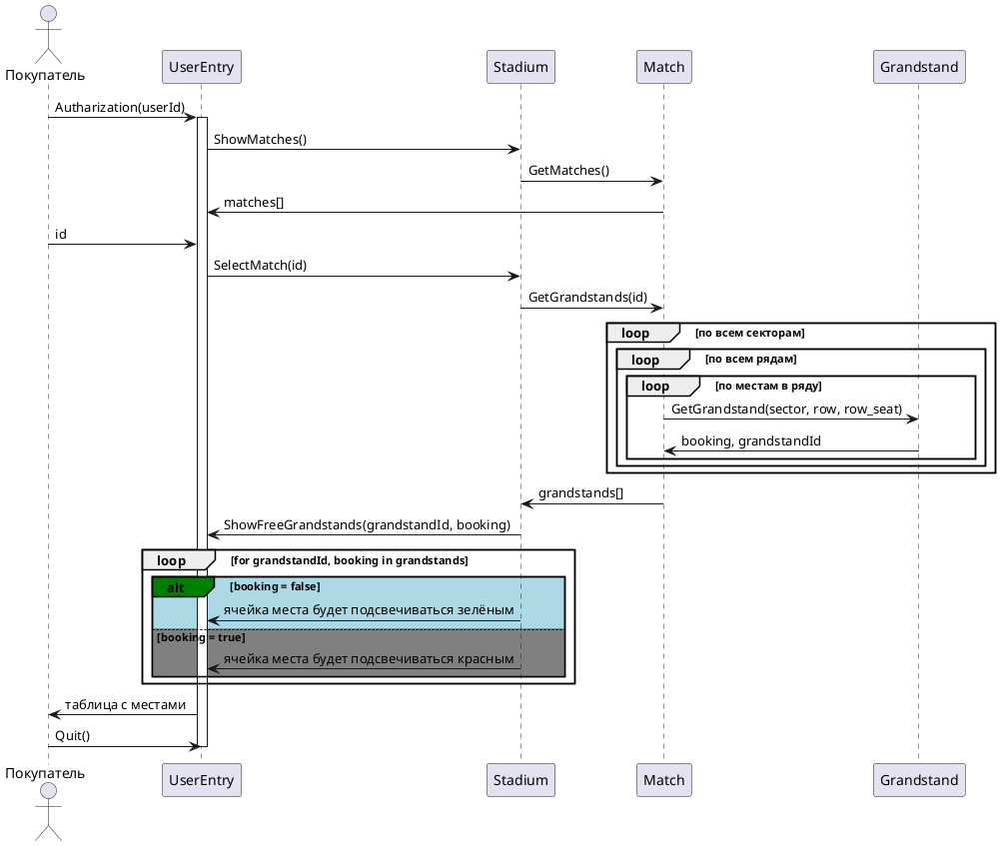

```plantuml
@startuml
actor Покупатель

Покупатель -> UserEntry : Autharization(userId)
activate UserEntry

UserEntry -> Stadium : ShowMatches()

Stadium -> Match: GetMatches()
UserEntry <- Match: matches[]

Покупатель -> UserEntry : id

UserEntry -> Stadium : SelectMatch(id)

Stadium -> Match : GetGrandstands(id)


loop по всем секторам
loop по всем рядам
loop по местам в ряду
Match -> Grandstand : GetGrandstand(sector, row, row_seat)
Match <- Grandstand : booking, grandstandId
end
end
end

Stadium <- Match : grandstands[]

UserEntry <- Stadium : ShowFreeGrandstands(grandstandId, booking)

loop for grandstandId, booking in grandstands
alt#green #lightblue booking = false
  UserEntry <- Stadium : ячейка места будет подсвечиваться зелёным
else #gray booking = true
  UserEntry <- Stadium : ячейка места будет подсвечиваться красным
end
end

Покупатель <- UserEntry : таблица с местами
Покупатель -> UserEntry : Quit()
deactivate UserEntry
@enduml
```
