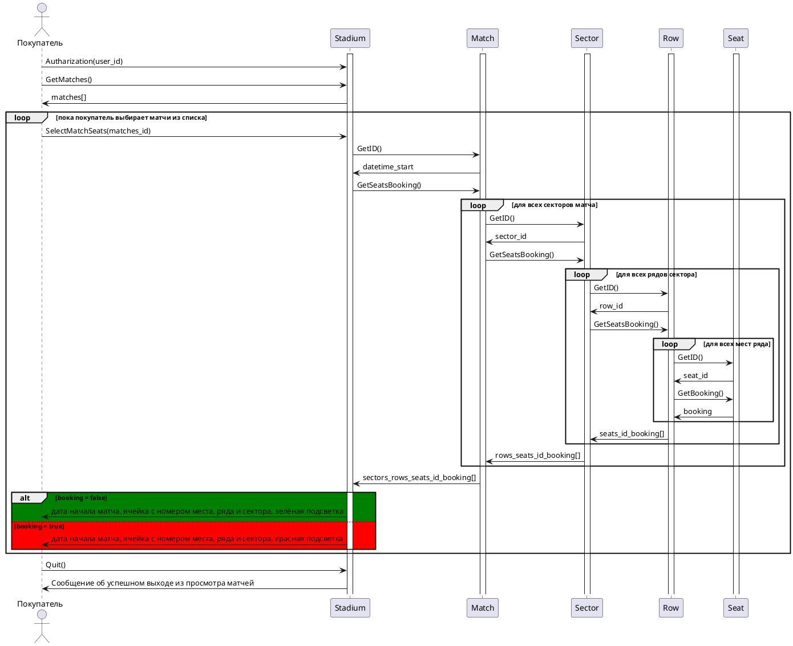

```plantuml
@startuml
actor Покупатель

activate Stadium
activate Match
activate Sector
activate Row
activate Seat

Покупатель -> Stadium : Autharization(user_id)

Покупатель -> Stadium : GetMatches()
Покупатель <- Stadium : matches[]


loop пока покупатель выбирает матчи из списка

Покупатель -> Stadium : SelectMatchSeats(matches_id)
Stadium -> Match : GetID()
Stadium <- Match : datetime_start
Stadium -> Match : GetSeatsBooking()


loop для всех секторов матча

Match -> Sector : GetID()
Match <- Sector : sector_id
Match -> Sector : GetSeatsBooking()

loop для всех рядов сектора

Sector -> Row : GetID()
Sector <- Row : row_id
Sector -> Row: GetSeatsBooking()

loop для всех мест ряда

Row -> Seat : GetID()
Row <- Seat : seat_id
Row -> Seat : GetBooking()
Row <- Seat : booking

end

Sector <- Row : seats_id_booking[]

end

Match <- Sector : rows_seats_id_booking[]

end

Stadium <- Match : sectors_rows_seats_id_booking[]

alt #green booking = false
  Покупатель <- Stadium : дата начала матча, ячейка с номером места, ряда и сектора, зелёная подсветка
else #red booking = true
  Покупатель <- Stadium : дата начала матча, ячейка с номером места, ряда и сектора, красная подсветка
end

end


Покупатель -> Stadium : Quit()
Покупатель <- Stadium : Сообщение об успешном выходе из просмотра матчей

@enduml
```
