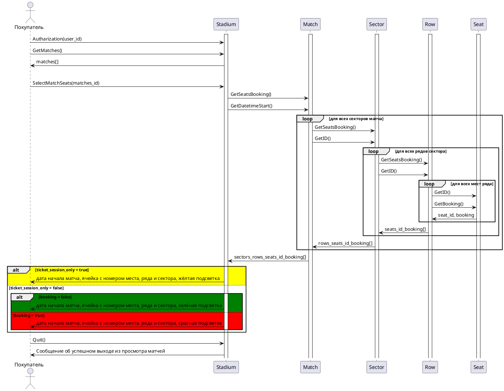

```plantuml
@startuml

actor Покупатель
participant Stadium
participant Match
participant Sector
participant Row
participant Seat

activate Stadium
activate Match
activate Sector
activate Row
activate Seat

Покупатель -> Stadium : Autharization(user_id)

Покупатель -> Stadium : GetMatches()
Покупатель <- Stadium : matches[]


loop пока покупатель выбирает матчи из списка

Покупатель -> Stadium : SelectMatchSeats(matches_id)
Stadium -> Match : GetSeatsBooking()
Stadium -> Match : GetDatetimeStart()


loop для всех секторов матча

Match -> Sector : GetSeatsBooking()
Match -> Sector : GetID()

loop для всех рядов сектора

Sector -> Row: GetSeatsBooking()
Sector -> Row : GetID()

loop для всех мест ряда

Row -> Seat : GetID()
Row -> Seat : GetBooking()
Row <- Seat : seat_id, booking

end

Sector <- Row : seats_id_booking[]

end

Match <- Sector : rows_seats_id_booking[]

end

Stadium <- Match : sectors_rows_seats_id_booking[]

alt #yellow ticket_session_only = true
  Покупатель <- Stadium : дата начала матча, ячейка с номером места, ряда и сектора, жёлтая подсветка
else #white ticket_session_only = false
  alt #green booking = false
    Покупатель <- Stadium : дата начала матча, ячейка с номером места, ряда и сектора, зелёная подсветка
  else #red booking = true
    Покупатель <- Stadium : дата начала матча, ячейка с номером места, ряда и сектора, красная подсветка
end

end


Покупатель -> Stadium : Quit()
Покупатель <- Stadium : Сообщение об успешном выходе из просмотра матчей

@enduml
```