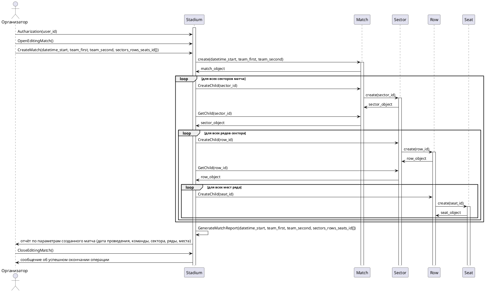

```plantuml
@startuml

actor Организатор

activate Stadium

Организатор -> Stadium : Autharization(user_id)
Организатор -> Stadium : OpenEditingMatch()
Организатор -> Stadium : CreateMatch(datetime_start, team_first, team_second, sectors_rows_seats_id[])

Stadium -> Match : create(datetime_start, team_first, team_second)
activate Match
Stadium <- Match : match_object


loop для всех секторов матча

Stadium -> Match : CreateChild(sector_id)
Match -> Sector : create(sector_id)
activate Sector
Match <- Sector : sector_object
Stadium -> Match : GetChild(sector_id)
Stadium <- Match : sector_object


loop для всех рядов сектора

Stadium -> Sector : CreateChild(row_id)
Sector -> Row : create(row_id)
activate Row
Sector <- Row : row_object
Stadium -> Sector : GetChild(row_id)
Stadium <- Sector : row_object

loop для всех мест ряда

Stadium -> Row : CreateChild(seat_id)
Row -> Seat : create(seat_id)
activate Seat
Row <- Seat : seat_object

end

end

end


Stadium -> Stadium : GenerateMatchReport(datetime_start, team_first, team_second, sectors_rows_seats_id[])
Организатор <- Stadium : отчёт по параметрам созданного матча (дата проведения, команды, сектора, ряды, места)

Организатор -> Stadium : CloseEditingMatch()
Организатор <- Stadium : сообщение об успешном окончании операции

@enduml
```